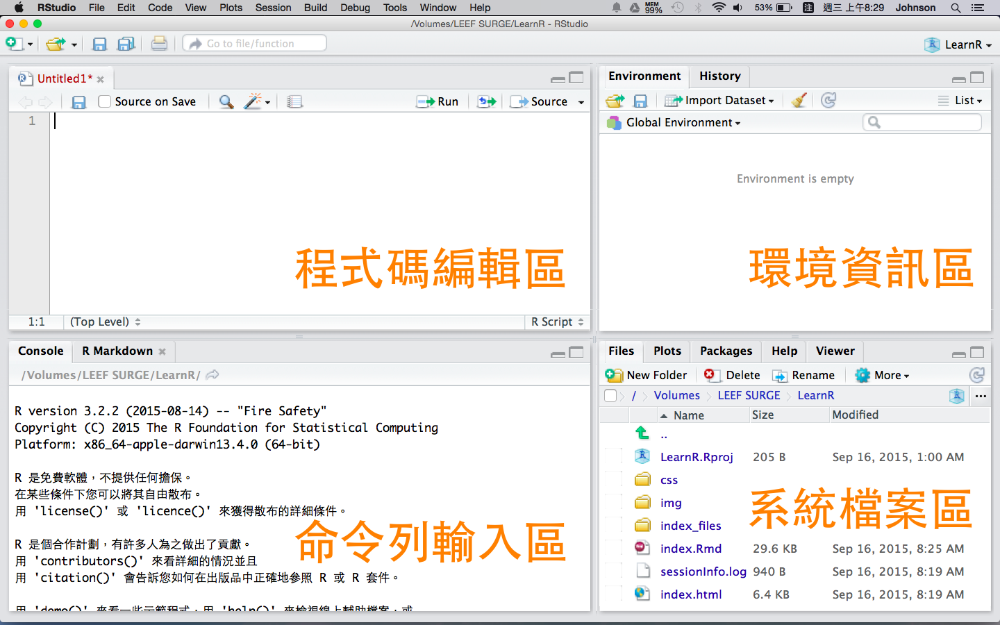
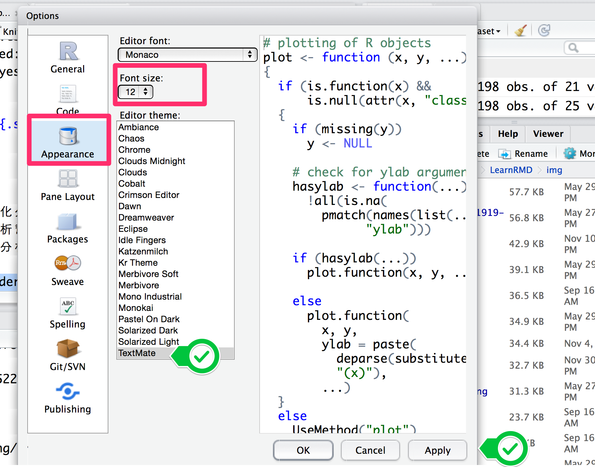

## About me
<div style='float:left;width:60%;'>
__國立政治大學統計所碩二__

#### __Experience__
<p>
  * Lalamove數據分析部門 Intern 2016.2-2016.9
  * 2017暑期資料工作坊SQL講師
  * 健保資料庫分析團隊
  * D4SG資料英雄專案計畫 #3
  * 2017 政大統計系資料競賽 亞軍 
  * 2017 Asia Open Data HACKATHON 最佳黑客獎
  * 2017 台電能源永續黑客松 第三名 
  
</div>

<div style='float:left;width:40%;'>
<br>

#### __Skills__
<p>
  * R
  * SQL Server
</div>

<div style='float:left;width:40%;'>
<br>

#### __Contact me__
<p>
  * [Github](https://github.com/ert5612p)
  * [Linkin](https://www.linkedin.com/in/佩雯-楊-950844b4/)
  * yangpennyjijc@gmail.com
</div>


# Ch01：為何要學 R 語言？
```{r setup, include=FALSE, cache=FALSE}
library(knitr)
library(magrittr)
library(xtable)
library(dplyr)
library(ggplot2)
library(sessioninfo)
library(httpuv)
library(caTools)
library(rmarkdown)

opts_chunk$set(echo = FALSE, cache=TRUE, comment="", cache.path = ".cache-EDA/")


fig <- function(path, size = 100) {
  sprintf("</img>", 
          path, size, size)
}
fig2 <- function(path, size = 100) {
  sprintf("</img>", 
          path, size)
}

sys_name <- Sys.info()["sysname"] %>% tolower
sys_encode <- c("utf8", "utf8", "big5")[pmatch(sys_name, c("linux", "darwin", "windows"))]
sessionInfo() %>% capture.output %>% cat(file = "sessionInfo.log", sep = "\n")
```


## R 是專門為資料分析而設計的程式語言 {.smaller .centered}
</img>
<h3>R 可以執行大多數的統計計算、機器學習、資料採礦方法</h3>
取自 <http://goo.gl/CkXlvY>

## 免費、開源、豐沛的社群資源 {.smaller .columns-2 .centered}
</img>
<h3>很容易擴充和客製化</h3>
取自 <http://goo.gl/AwfHLx>

</img>
<h3>很容易和其他工具做整合</h3>
取自 <http://goo.gl/jvNnG3>

## R 可以輸出高品質的視覺化 {.smaller .centered}

</img>

取自 <http://goo.gl/q1NX26>


## 課程目標

<ul style="font-size: 120%">
<li>建立 R 的使用環境</li>
<li>熟悉 R 語言基礎操作</li>
<li>了解 R 語言的物件的結構</li>
<li>體會 R 語言的流程控制</li>
<li>學習 R 語言的資料整理</li>
<li>確立 R 語言的資料爬析概念</li>
</ul>

## Introduction to R

#### __如何熟悉 R ？__
<p>
- 搭訕它 --> 認識它 --> 攻陷它
<p>

#### __不怕問問題__
<p>
- __help or ?__：使用於`清楚知道`函數名稱時
- __??__：使用於`不確定`確切函數名稱時
- Google絕對是妳/你在學 R 的最佳良師
- 高手藏在網路的每個角落：[Stack overflow](http://stackoverflow.com)
<p>

#### __養成寫註解的習慣__
<p>
- __#__：已於開頭輸入註解符號的該行不會被執行
- __大量註解快捷鍵__：ctrl/command + shift + C


# Ch02：建立 R 的使用環境

## 傢俬準備好 {.columns-1}

### 環境安裝
- 主程式：[R](https://www.r-project.org/)（R-3.2.5 以上版本）
- 編輯界面：[RStudio IDE](https://www.rstudio.com/products/rstudio/)（0.98.1103 以上版本）
- [疑難排解指南](https://github.com/dspim/R/wiki/R-&-RStudio-Troubleshooting-Guide)  \
<br>
**記得先安裝 R 再安裝 RStudio 噢！**
<br>
<br>


### RStudio 界面說明
- 程式碼編輯區
- 命令列區
- 環境資訊區
- 檔案系統區


## RStudio 界面說明
</img>


## 熟悉 RStudio 的 **命令列** 界面  

### 程式的**輸入**、**輸出**、**中斷**

- 左下角當符號 `>` 表示可以輸入指令
- 輸入 `1 + 1` 後按下 **Enter**，檢查螢幕輸出
- 輸入 `1 +  ` 後按下 **Enter**，檢查螢幕輸出 <br> 最左下角的開頭變成 `+` 表示指令尚未輸入完成，應繼續輸入
- 按下 **ESC**，會中斷執行中的程式 (左下角回復成 `>` 開頭)
- 快捷鍵成癮者請進：[Keyboard Shortcuts](https://support.rstudio.com/hc/en-us/articles/200711853-Keyboard-Shortcuts)

## 熟悉 RStudio 的 **程式碼編輯** 界面
### 停留時間最多的區域
- **New File -> R Script -> Untiled1.R**
- 欲執行程式碼請大膽按下：<br> **Control + Enter** (Windows) or **Command + Enter** (Mac)  \
<br>
- 在程式碼編輯區中輸入 `1 + 1` 後按下 **Control + Enter**，檢查 命令列區
- 在程式碼編輯區中輸入 `1 + ` 後按下 **Control + Enter**，檢查 命令列區
- 在命令列區按下 **ESC** 中斷程式


## 調整字型大小


- **Tools -> Global Options -> Appearance**
</br>
</br>
</img>


# Ch03 今天學完，你一定會用R做資料整理

## 先別想，複製貼上就是了

```{r echo=TRUE}
dat1 <- data.frame(date=c("11/29","11/30","12/01","12/02","12/03","12/04","12/05"),
                   weekday=c("Sun", "Mon", "Tue", "Wed", "Thu", "Fri", "Sat"))
dat1 # print R object
```
```{r echo=TRUE, eval=FALSE}
dat1[1, 1]  # 取值 #[列,欄]
dat1[, 1]   
dat1[1:2,] 
```

## 先別想，複製貼上就是了

```{r echo=TRUE}
dat2 <- data.frame(date=c("11/29","11/30","12/01","12/02","12/03","12/04","12/05"),
                   temp=c(17, 18, 24, 20, 21, 22, 24))
dat2 # print R object
```

```{r echo=TRUE, eval=FALSE}
dat2[, 2]
dat2[, 2] * 2   
dat2[, 2] + c(1, 0, -0.5, 2, 3, -2, 0.5) 
```

## 先別想，複製貼上就是了
```{r echo=TRUE}
dat2[dat2$temp<20,]
dat2[grepl("11", dat2$date), ]
cbind(dat1,temp=dat2$temp)[dat2$temp<20,]
```


# Ch04：基礎教學 - 敘述句與數列

## 敘述句

<div style='float:left;width:48.5%;'>

```{r echo=TRUE}
1
1 + 1
1 ; 2
1 + 1 ; 1 + 2
``` 

</div>

<div style='float:left;width:48.5%;'>
### 筆記
- 灰底的區塊為程式碼 (輸入)，[1] 為運算結果 (輸出)
- 敘述句以**斷行 (Enter)** 或**分號 ( ; )** 作結尾
- 未完成的敘述句，命令列開頭會變成 `+`
- 可以用 **Esc** 中斷敘述句
- R 會把單引號 'apple' 或雙引號 "apple" 所包覆的敘述當成字串

</div>


## 敘述句2

<div style='float:left;width:48.5%;'>
```{r echo=TRUE}
# 基礎運算
1 + 2 + 3
1 +       2 + 3
x <- 1 + 2
y <- 4
(x + y) / 2 # 簡單的公式運算
```

</div>

<div style='float:left;width:48.5%;'>

### 筆記
- 基本數學運算符號 (`+`, `-`, `*`, `/`, ...)
- 空白 (**space**) 不影響程式執行
- 箭號 (`<-`) 表示賦值，把箭號右邊的結果指向到R物件
- 井號 (**#**) 表示註解，使得該行不執行運算
- 在RStudio中，想要一次註解多行可用 **ctrl + shift + c**
- 在命令列中按 **ctrl + l** 可以清除當前畫面

</div>

## 最基礎的物件：數值型向量 (數列)

<div style='float:left;width:48.5%;'>

```{r echo=TRUE}
# basic expression of integer vector
c(1, 2, 3, 4)

# simple expression
1:4
4:1
```

</div>

<div style='float:left;width:48.5%;'>

### 筆記
- 以 `c(...)` 表示 (c 取自combine之意), 整個函數內容以 `() `包括起來，元素以逗號分隔。
- 連續整數向量可以利用 `:` (冒號) 簡記，譬如數列 (1, 2, 3, 4) 在 R 語言中可利用 `1:4` 簡記
- 也可以使用 `4:1` 的簡記方式來產生 (4, 3, 2, 1) 的向量

</div>

## 如何生成有序的數值向量

<div style='float:left;width:48.5%;'>

```{r echo=TRUE}
seq(1, 4)
seq(1, 9, by = 2) # 間隔為2
seq(1, 9, length.out = 5) # 分割長度為5
```

</div>

<div style='float:left;width:48.5%;'>

### 筆記
- 除了冒號簡記法外，可以透過`seq`函數生成有規則的數值向量(序列)  
- 在`seq()` 函數中按 **tab** 鍵觀察有哪些參數可以使用
- `by` 表示數列間隔，預設為1
- `length.out` 表示數列長度

</div>

<div style='float:left;width:48.5%;'>

## 小挑戰
- 利用簡記法列出 1 ~ 10的數列
- 利用 `seq` 函數列出偶數數列: 2, 4, 6, 8, 10
- 觀察 `seq(1, 10, length.out=5)` 的輸出結果
<p> </p>
<p> </p>
<p> </p>
<p> </p>
<p> </p>
<p> </p>

##
參考解答
```{r echo=TRUE}
1:10
seq(2, 10, by = 2)
seq(2, 10, length.out = 5)
seq(1, 10, length.out=5)
```
</div>


# Ch05：基礎教學 - 數列的運算
## 數列的運算 {.columns-1}
R的數列運算滿足 **recycling properties**
```{r echo=TRUE}
c(1, 2, 3) * c(2, 2, 2)
# shorter arguments are recycled
1:3 * 2
c(0.5, 1.5, 2.5, 3.5) * c(2, 1)
```

<p>
<p>
<p>
<p>
<p>

## 小挑戰
向量的四則運算，請計算以下五位女藝人的BMI

Hint: BMI = 體重 / (身高/100)^2
```{r echo=TRUE, eval=FALSE}
height <- c(174, 158, 160, 168, 173)
weight <- c(52, 39, 42, 46, 48)
```

<div class="notes">
```{r echo=TRUE, eval=TRUE}
height <- c(174, 158, 160, 168, 173)
weight <- c(52, 39, 42, 46, 48)
weight/ (height/100)^2
```
</div>

## 向量的取值

- 在`[ ]` (中括號) 中輸入元素的位置進行取值
- 使負號 (`-`) 移除給定位置元素 (反向選取)

<div style='float:left;width:48.5%;'>
```{r echo=TRUE}
x <- c(174, 158, 160, 168, 173)
x[1]           # 選取第1個位置的元素
x[c(1, 3)]     # 選取第1, 3個位置的元素
```
</div>

<div style='float:right;width:48%;'>
```{r echo=TRUE}
x[c(2, 3, 1)]  # 依序取值

# 在[ ]中使用負號 (-) 做反向選取
x[-1]
x[-c(1, 3, 4)]
```
</div>

## 向量的取值2 

給定條件進行取值

- 比較運算子(`>`, `<`, `>=`, `<=`, `==`, `!=`)
- 邏輯運算子 (`&`, `|`)

```{r echo=TRUE}
x > 160

# 使用比較運算子 加上 `which` 函數進行取值
index <- which(x > 160) 
index 
x[index]
```

## 向量的取值3

指令壓縮，將指令寫在 [ ] 中，以達到縮短程式碼的功效
```{r echo=TRUE}
x[which(x > 160)]

# 配合邏輯算子進行多條件的取值
x[which(x > 160 & x < 175)]

# 可以省略 which
x[x > 160 & x < 175]
```


## 向量的取代
- 利用 `[ ]` (中括號) 與 `<-` (箭號) 進行取代與新增元素

<div style='float:left;width:48.5%;'>
```{r echo=TRUE}
x <- c(174, 158, 160, 168, 173)
x

# 取代特定位置的元素
x[2] <- 158.5 # 取代x物件的第二個元素
x
```

</div>

<div style='float:right;width:48%;'>
```{r echo=TRUE}
x[c(1, 5)] <- 175 
x

# 也可以用條件篩選做取代
x[x > 160] <- 170 # 取代大於160的值為170
x
```
</div>

## 向量新增

- 可用 `[ ]` (中括號) 與 `<-` (箭號) 進行新增元素  
- `NA` 為系統保留字，表示Not Available / Missing Values  

<div style='float:left;width:48.5%;'>
```{r echo=TRUE}
x <- c(174, 158, 160, 168, 173)
x
# 在 [ ] 中新增元素
x[6] <- 168
x
```
</div>

<div style='float:right;width:48%;'>
```{r echo=TRUE}
x[8] <- 147
x # 未指定的元素值預設為NA
length(x) # 查看向量物件的長度
x[length(x) + 1] <- 166 # 接續增加新元素
x
```
</div>
# Ch06：查詢說明檔
## 在 R 中查詢說明文件

<div style='float:left;width:48.5%;'>

各種自救措施
```{r echo=TRUE, eval=FALSE}
help.start()
ab # 輸入`ab`後 按下tab
?abs   # 等同於 help(abs)
??abs 
vignette()
vignette("Introduction", "Matrix")
```
</div>

<div style='float:left;width:48.5%;'>

### 筆記

- help.start: 說明檔首頁
- 自動完成 (tab鍵)：列出所有`ab`開頭的函數
- ? (一個問號)：查詢特定函數的說明檔
- ?? (兩個問號)：查詢包含特定關鍵字的說明檔
- apropos : 查詢包含特定關鍵字的函數
- example : 執行特定函數的使用範例
- vignette : 查詢R環境中各種介紹文件

</div>

# Ch07：資料測量的尺度

## R 的資料形態分類

```{r results='asis'}
knitr::kable(data.frame("資料衡量尺度"=c("連續資料","比例資料","區間資料","順序資料","名目資料","布林資料","文字資料"),
           "R變數形態"=c("numeric","numeric","numeric","factor","factor","logical","character"),
           "特性"=c("數值","比值","大小距離","優先順序","類別","邏輯值","文字"),
           "範例"=c("身高","流失率","溫度","名次","國家","True & False","電話號碼")))
```


## 判斷 Logical 

產生自比較，或是使用`T`、`TRUE`、`F`或`FALSE`輸入
```{r  echo=TRUE}
x <- 1 # 賦值
x < 2
x <= 1
```

## 字串 (Character)

- 輸入的時候利用`"`或`'`來包覆要輸入的文字
- 常用的Character處理函數 

<div style='float:left;width:48.5%;'>
字串的連接：`paste`
```{r echo=TRUE}
x <- "bubble"
y <- "bobble"
paste(x, y, sep=",")
```

字串的切割：`strsplit`
```{r echo=TRUE}
strsplit(x, "u")
```
</div>

<div style='float:right;width:48%;'>
截取子字串：`substring`
```{r echo=TRUE}
name1<-"郭雪芙"
substring(name1, 1, 1)
```

計算字串長度：`nchar`
```{r echo=TRUE}
nchar(name1) # 試著與 length 函數比較
```
</div>

## 小挑戰 
- 取出金城武的姓
- 取出字串 `a <- "2015-12-14"` 的月份

## 解答

```{r echo=TRUE}
# 取出金城武的
name2<-"金城武"
substring(name2, 1, 2)

# 取出字串 "2015-12-14" 的月份
a <- "2015-12-14"
substring(a, 6, 7)

tmp <- strsplit(a, "-")
tmp[[1]][2]
```


## Factor (類別)
如何處理名目變數?

<div style='float:left;width:48.5%;'>

```{r  echo=TRUE}
x <- c("F","M","F","F")
x
x <- factor(c("F","M","F","F"), levels=c("F","M"))
x
```

</div>

<div style='float:left;width:48.5%;'>

```{r echo=TRUE}
x <- factor(c("F","M","F","F"), levels=c("F"))
x
levels(x)
as.integer(x)
```

</div>

## 如何處理順序資料?

```{r echo=TRUE}
#舉個例子 - 班上一號到六號分別拿到A, B, C的級別
rank=factor(c("C","A","B","B","C","C"), order=TRUE, level=c("C","B","A"))
rank
rank[1] < rank[2]

```

# Ch08: 資料型態的轉換

## 向量有同質性 Vector 

向量元素必須是同個資料屬性
```{r echo=TRUE}
x <- c(1, 2.0, "3")
x
```

## 資料型態的轉換 


- 利用以下函數自行轉換向量型態： `as.character`, `as.numeric`, `as.logical`。

<div style='float:left;width:48.5%;'>
```{r echo=TRUE}
x <- c(1, 2.0, "3")
x <- as.numeric(x)
x
```
<p>
<p>
<p>
<p>
<p>

</div>

<div style='float:left;width:48.5%;'>

```{r echo=TRUE}
y <- c("1", "2", "3", "2", "a")
y <- as.numeric(y)
y
```

- `NA`代表Not available，代表著**missing value**

</div>

## 資料型態的轉換2

<div style='float:left;width:48.5%;'>

```{r echo=TRUE, eval=TRUE}
# 字串轉數字
a1 <- c("89", "91", "102")
a1 <- as.numeric(a1)
a1
# 布林轉數字
a2 <- c(TRUE, TRUE, FALSE)
a2 <- as.numeric(a2)
a2
```
</div>

<div style='float:left;width:48.5%;'>

```{r echo=TRUE, eval=TRUE}
# 數字轉布林
a3 <- c(-2, -1, 0, 1, 2) 
# 只有0會被轉成FALSE
a3 <- as.logical(a3)
a3
# 數字轉字串
a3 <- as.character(a3)
a3
```
</div>

## 資料型態的轉換3

```{r as.character, echo = TRUE}
z <- c(1, 2, 3, 2, 3, 2, 1)
z <- as.numeric(z) # 數值
z
z <- factor(z) # 轉類別
z
```


# Ch09: List 存放異質性資料的容器

## List 
```{r echo=TRUE, eval=T}
x1 <- c("林志玲", 174, 52, TRUE)   # 所有元素都被轉換成字串
x1
x2 <- list("林志玲", 174, 52, TRUE) # 保留資料型態
str(x2)
```

## List 賦值/取值

```{r echo=TRUE}
x3 <- list(name=c("林志玲", "隋棠", "蔡依林"), 
           height=c(174, 173, 158),
           weight=c(52, 48, 39),
           model=c(TRUE, TRUE, FALSE))
x3
```

## List 賦值/取值2

```{r echo=TRUE}
x3[[1]]
x3$name
x3[["name"]]
names(x3)
names(x3) <- c("Name", "Height", "Weight", "Model")
names(x3)
```


# Ch10：DataFrame 資料表

## 資料表 `data.frame`

- `data.frame` 是資料分析時最基本的物件
- `R` 提供將外部資料轉成 `data.frame` 的功能
- 透過`data.frame` 可以進行以下功能：
    - 資料的整理
    - 圖形的繪製
    - 模型的配適與預測


## 世界上最常見的範例資料 `iris`  
```{r echo=TRUE, eval=T}
data("iris")
head(iris) # 列出前幾筆資料, 預設6筆
dim(iris)  # 列出資料表的 rows and columns
```

## 表格的取值 - 座標
- 類似於向量取值，在中括號 `[i, j]` 中進行取值
- 逗號的前後分別表示資料表的 row and column
```{r echo=TRUE}
iris[2, 3]
iris[1:6, 1:3]
```

## 表格的取值 - 列
欲選取第i筆觀察資料時，使用 `[i, ]` 在column欄位留白
```{r echo=TRUE}
iris[2, ]
iris[c(1, 51, 101),]
```

## 表格的取值 - 欄
欲選取整欄資料時，有三種常用方法
```{r echo=TRUE, eval=FALSE}
iris[,1] # 欄位名稱未知
iris$Sepal.Length # 已知欄位名稱
iris[["Sepal.Length"]] # 已知欄位名稱 
```
```{r}
iris[["Sepal.Length"]]
```

## 表格的取值 - 篩選
利用條件式做篩選
```{r echo=TRUE}
iris[iris$Sepal.Length > 5.5 & iris$Species=="setosa", ]
```

# Ch11: Pattern Matching and Replacement

## 關鍵字的取代與查找 - `gsub`
`gsub(pattern, replacement, x)`
```{r echo=TRUE}
year <- c("民國99", "民國100", "民國101")
gsub("民國", "", year)
as.numeric(gsub("民國", "", year)) + 1911
```

## 關鍵字的取代與查找 - `grep`
- `grep(pattern, x, value=FALSE)`
- `grepl(pattern, x)`
- `grep(pattern, x, value=TRUE)`

```{r echo=TRUE}
title <- c("馬習會前交涉祕辛曝光", "馬說明馬習會：公布逐字稿不可思議的透明", "談22K政策朱立倫：不幸被企業濫用")
grep("馬習會", title)
grepl("馬習會", title)
grep("馬習會", title, value = TRUE)
```

## 關鍵字的取代與查找 - `gregexpr`
```{r echo=TRUE}
txt <- c("名模林志玲身高有174公分，體重52公斤", "女神蔡依林身高158公分，體重只有39公斤")
matches <- gregexpr("[0-9]+", txt)
regmatches(txt, matches)
```

### 筆記
- `[0-9]`  -> 0|1|2|3|4|5|6|7|8|9
- `[0-9]+` -> 一或多個0|1|2|3|4|5|6|7|8|9
- [正規表示法](https://atedev.wordpress.com/2007/11/23/%E6%AD%A3%E8%A6%8F%E8%A1%A8%E7%A4%BA%E5%BC%8F-regular-expression/)


## Recap
- 取代：`gsub`
- 查找位置：`grep(value=FALSE)`, `grep(value=TRUE)`, `grepl`
- 查找結果：`grepexpr`


## 補充資料
- [Learn R in R (Swirls)](https://github.com/wush978/DataScienceAndR)
- [Text Processing (wikibooks)](https://en.wikibooks.org/wiki/R_Programming/Text_Processing)
- [Introduction to R (around 4 hours)](https://www.datacamp.com/courses/free-introduction-to-r)
- [Cookbook for R](http://www.cookbook-r.com/)

## 繼續學習之路
- 了解自己的需求，詢問關鍵字與函數
- [Taiwan R User Group](http://www.meetup.com/Taiwan-R)，mailing list: Taiwan-useR-Group-list@meetup.com
- [ptt R_Language版](https://www.ptt.cc/bbs/R_Language/index.html)
- [R軟體使用者論壇](https://groups.google.com/forum/#!forum/taiwanruser)
- [StackOverflow](http://stackoverflow.com/) 
- 歡迎來信 yangpennyjijc@gmail.com 與我一起交流！