```{r setup, include=FALSE, cache=FALSE}
suppressPackageStartupMessages({
  library(knitr) 
  library(magrittr)
  library(dplyr)
  library(ggplot2)
  library(xtable)
  library(data.table)
  library(DT)
})
opts_chunk$set(echo = TRUE, cache = FALSE, comment="")
fit100 <- function(fname) sprintf('', fname)
fit50 <- function(fname) sprintf('', fname)
fig <- function(fname, size=100) 
  sprintf('', fname, size, size)
fig2 <- function(path, size = 100) {
  sprintf("</img>", path, size)
}
sys_name <- Sys.info()["sysname"] %>% tolower
sys_encode <- c("utf8", "utf8", "big5")[pmatch(sys_name, c("linux", "darwin", "windows"))]
sessionInfo() %>% capture.output %>% cat(file = "sessionInfo.log", sep = "\n")
thm <- theme(text=element_text(size=18))
las2 <- theme(axis.text.x = element_text(angle = 90, hjust = 1))
```


##  複習第一週
* 建立 R 的使用環境
* 熟悉 R 語言基礎操作
    * 敘述句、數列
    * 查詢說明檔
* 了解 R 語言的物件的結構
    * 變數型態：logical、numeric、character、factor
    * 資料存放容器：list、data.frame

##  複習第二週
*  R 語言的流程控制
    * if、else
    * for loop
    * 自訂 function
*  R 語言的資料整理
    * 讀檔
    * dplyr
*  R 語言的資料爬析概念

##  複習第三週
* 資料視覺化（ggplot2）
    * 基本語法
    * 各式圖形畫法
    * 參數調整

##  資料分析流程
- 資料採集
- 資料清洗處理
- 統計及分析
- 視覺呈現

> - <p style="color:#750000;font-size:36px;">報告產出</p>

## 資料分析 in R 

<center>
`r fig("ResearchPipeline.png", 84)`   
<small>https://www.coursera.org/course/repdata</small>
</center>

## What is Markdown？
- 啟發自2004年純文字電子郵件
- 好寫、好讀
- 可以純文字發布
- [Markdown](http://daringfireball.net/projects/markdown/basics)
    - Light weight markup language
    - Remove HTML tag for higher readibility.
    - Inline HTML is avaliable.
    - HTML5 Introduction ([w3schools.com](https://www.w3schools.com/html/html5_intro.asp))

## What is RMarkdown？
- 可以在 Markdown 內嵌 R code
- 一次呈現執行程式碼後的結果及文字說明
- 不用再把圖、表複製到其他文件編輯器中
- Rmd -> md -> html (docx, pdf)

## Why we need R Markdown？

- 時間久了會忘記code的意思
- 要寫說明文件給同學、同事、教授、主管
- 教授很有想法，想嘗試新方法 <br> (~~FK！又要重跑一份~~)
- 老闆說要改流程 <br> (~~MD!之前貼到簡報上的圖又要重貼一份~~)

> - **專案報告要呈現，code改了，但是文件無法同時修改！** <br> 


## Why we need R Markdown？
- 製作reproducible的報告、投影片
- 想寫數學式子好展現自己的專業 $e=mc^2$
- 只有一份source code，不需要額外複製圖片到報告中
- 需求更改時，可以動態改變報告內容
- 增加資料分析演算法的可讀性
- IDE? RStudio提供支援

## 前置作業 - 安裝
- 最新版的RStudio已經包含R Markdown功能
- 你也可以透過以下指令安裝R Markdown套件：

```{r eval=FALSE, echo=TRUE}
install.packages("rmarkdown")
```

# R Markdown 快速導覽

## 打開你第一個RMarkdown

`Document`
<center>
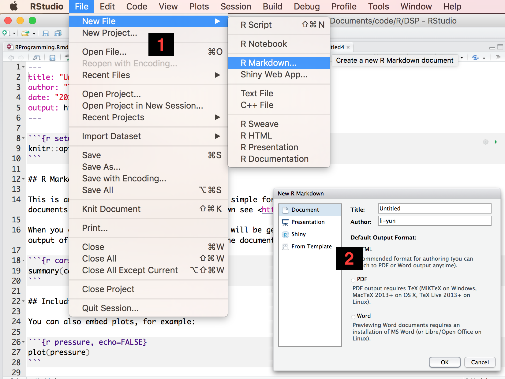
</center>

## Overview

<center>
`r fig("RmdOverview_1.png", 80)` 
</center>

## Markdown

<center>
`r fig("markdownOverview.png")`  
</center>

## R Code Chunks

<center>
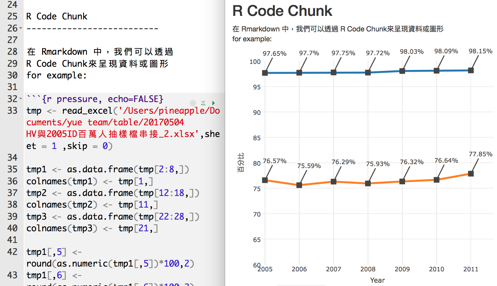
</center>


## Inline R Code and Equations

- 利用 \`r\` 在markdown中插入R程式
- 插入 LaTeX 公式的方法：   
    * 行內`$ equation $`   
    * 段落 `$$ equation $$`
- for example :
    - 這是DSP推出的第 `r  3+1` 門課程
    - 熵指標的公式為$-\sum{p_i \log{p_i}}$ ，表示系統的亂度
    - [markdown 公式輸入參考](http://oiltang.com/2014/05/04/markdown-and-mathjax/)
    
`r fig("InlineEx.png", 80)`  

## Rendering Output
- RStudio: "Knit" command (Ctrl+Shift+K)
- Command line: rmarkdown::render function

```{r eval=FALSE, echo=TRUE}
rmarkdown::render("input.Rmd")
```

# Markdown Basics

## Markdown Quick Reference

在RStudio中，也可以找到RMarkdown的作弊小文件！

<center>
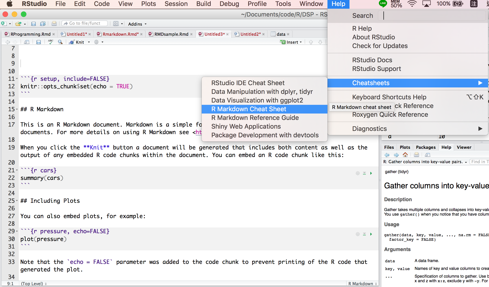
</center>

## 標題！

### Headers
- 字體大小：使用井字號
    - `# Header 1`
    - `## Header 2`
    - `### Header 3`
    - `#### Header 4`
    - `##### Header 5`
    - `###### Header 6`


## 字體！

- 我是正常文字
- 粗體：使用`**bold**` 或 `__bold__` 
- 斜體：使用 `*italics*` 或 `_italics_`
- 刪除線：使用`~~我是豬~~`

<p style="color:#0000C6;">結果：</p>
- 我是正常文字\
- **粗體：bold** \
- *斜體：italics* \
- 刪除線：~~我是豬~~

## Attach pictures
- 貼上照片
- [img](http://www.w3schools.com/tags/tag_img.asp): inserting images into an HTML document.
    
    Much easier for adjusting width and height.
```html


```
<center></center>  
<center></center>  

## 先來簡單的複製貼上！
- 利用`+`、`*`、`-`，列點文字
- 嵌入圖片： `image:  `
- 嵌入連結：`[木下柚香](https://www.youtube.com/watch?v=ArPaid2Iuck&t=49s)`
- 嵌入表格：
    ```
       標題一     |    標題二     
    -------------| ------------- 
        123      |    456        
        789      |    0.0        
    ```

## Exercise - 1
<p style="color:#003E3E;">請大家以下面的文字為樣板，打出一篇簡短的自我介紹：</p>

大家好，我是**Nicole**`(1.使用粗體)`，目前就讀於國立政治大學，家裡共有：

`(2.請列點)`

- 我爸\
- 我媽\
- 我\
- 我妹妹\

有四個成員，我是女生，我長這樣：
`(3.請放照片)`


`(4.請放你的臉書連結)`
想要和我做朋有的人可以加我[臉書](https://www.facebook.com/profile.php?id=100000344369057)


## Answer - 1

```
大家好，我是**Nicole**(1.使用粗體)，目前就讀於國立政治大學，家裡共有：\

+ 我爸 \
+ 我媽 \
+ 我 \
+ 我妹妹 \

有四個成員，我是女生，我長這樣： 

想要和我做朋有的人可以加我[臉書](臉書路徑)

```

## 補充
- 連結網站
- [iframe](http://www.w3schools.com/tags/tag_iframe.asp): displaying a web page within a web page

```html
<iframe src="https://dsp.im/" height=600 width=800></iframe>
```
<iframe src="https://dsp.im/" height=600 width=800></iframe>


# R Code Chunks

## Overview
- 在 R Code Chunk 中，code可以被執行
- code會被```{r}及```包圍
- 快捷鍵（for windows、mac）：alt + control/command + i
- 將下列文字複製貼上並Knit：

<pre class="markdown"><code>&#96;&#96;&#96;{r}
summary(cars$dist)
&#96;&#96;&#96;
</code></pre>

```{r plot}
summary(cars$dist)
```

## 命名 R code chunks 

<pre class="markdown"><code>
&#96;&#96;&#96;{r plot}
summary(cars)
plot(cars)
&#96;&#96;&#96;
</code></pre>

<center>
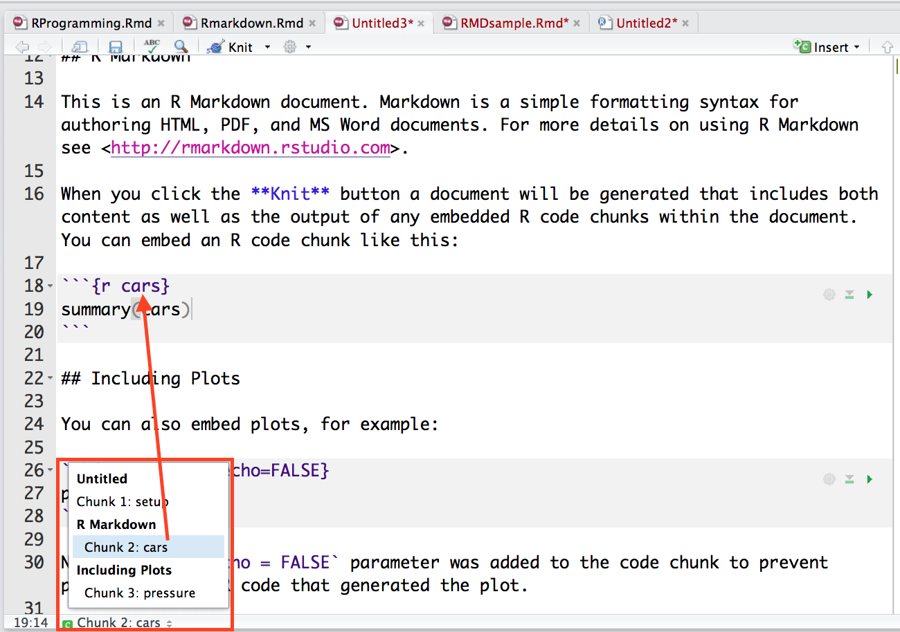
</center>

## Basic Chunk Options - 1

- `echo`(TRUE): whether to include R source code in the output file
- `eval`(TRUE): whether to evaluate the code chunk
- `message`(TRUE): whether to preserve messages emitted by message()
- `include`(TRUE): if include=FALSE, nothing will be written into the output document, but the code is still evaluated and plot files are generated
- `warning`(TRUE): whether to preserve warnings in the output 
- `comment`("##"): set to comment notation 

## Basic Chunk Options - 2
### 常用
- `defult`：show code and output 
- `echo = FALSE` ：only show output
- `eval = FALSE` ：only show code
- `include = FALSE` ： run code and don't show output

## Basic Chunk Options - 3

利用每個chunk右上的設定鍵

<center>
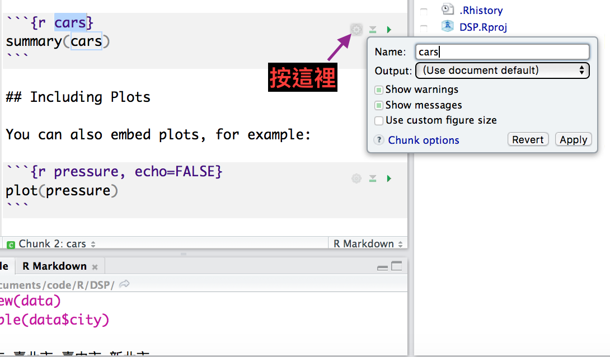
</center>

## 執行部分chunk
在編輯 RMarkdown 的過程中，想要測試 chunk 中的 code 是否成功，但又不想要每次檢查都 knit，不僅花費太多不必要的時間也浪費系統資源

- 將游標點選在想要測試的 chunk 中任何一個位置
- chunks 選單中，點選 Run Current Chunk 
- 快捷鍵：Alt + Ctrl + C

<center>
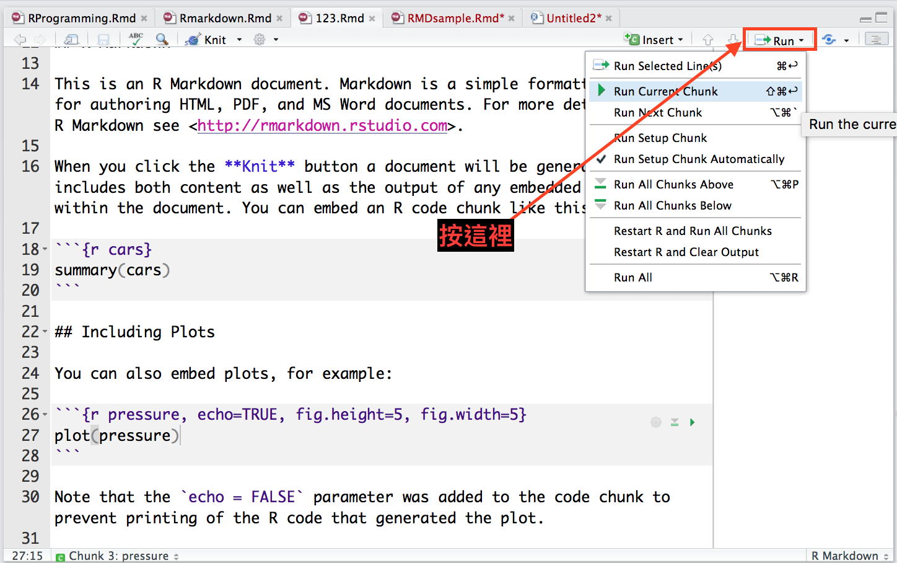
</center>


## Exercise - 2.1

<center><p style="color:#0000C6;font-size:32px;"> 請大家利用 iris 的資料依照不同的品種，</p></center>
<center><p style="color:#0000C6;font-size:32px;"> 畫出 Sepal.Length 及 Petal.Length 的 scatter plot</p></center>


## Answer - 2.1

```{r, fig.align='center', fig.height=4, fig.width=8, message=FALSE, warning=FALSE}
iris %>% 
  ggplot(aes(x=Sepal.Length, y=Petal.Length, color=Species)) + 
  geom_point(shape=1, size=2) # shape控制圖示；size控制點的大小

```

## Exercise - 2.2

<center><p style="color:#0000C6;font-size:32px;"> 請大家在 Rmarkdown 中產出將剛剛的 scatter plot </p></center>

## Answer - 2.2

### 第一個chunk
<pre class="markdown"><code>
&#96;&#96;&#96;{r, echo=TRUE, message=TRUE, warning=TRUE}
library(dplyr)
library(ggplot2)
&#96;&#96;&#96;
</code></pre>

### 第二個chunk
<pre class="markdown"><code>
&#96;&#96;&#96;{r}
iris %>% 
  ggplot(aes(x=Sepal.Length, y=Petal.Length, color=Species)) + 
  geom_point(shape=1, size=2) 
&#96;&#96;&#96;
</code></pre>

## Exercise - 3

利用R Markdown 製作《一周天氣預報》書面報告。

- [原始出處](http://www.cwb.gov.tw/V7/forecast/taiwan/Taipei_City.htm)
- [範例資料下載](https://pongponglin.github.io/2017NCCU_R/data/weatherbig5.csv)

## 原始網頁  

<center>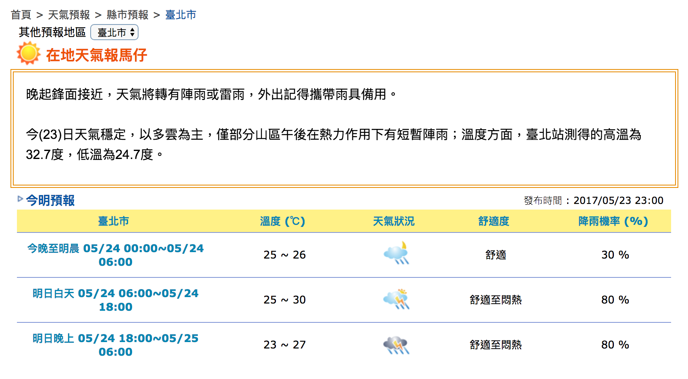</center>  

## Rmarkdown 呈現
[範例連結](https://pongponglin.github.io/2017NCCU_R/RMDsample.html)
<center>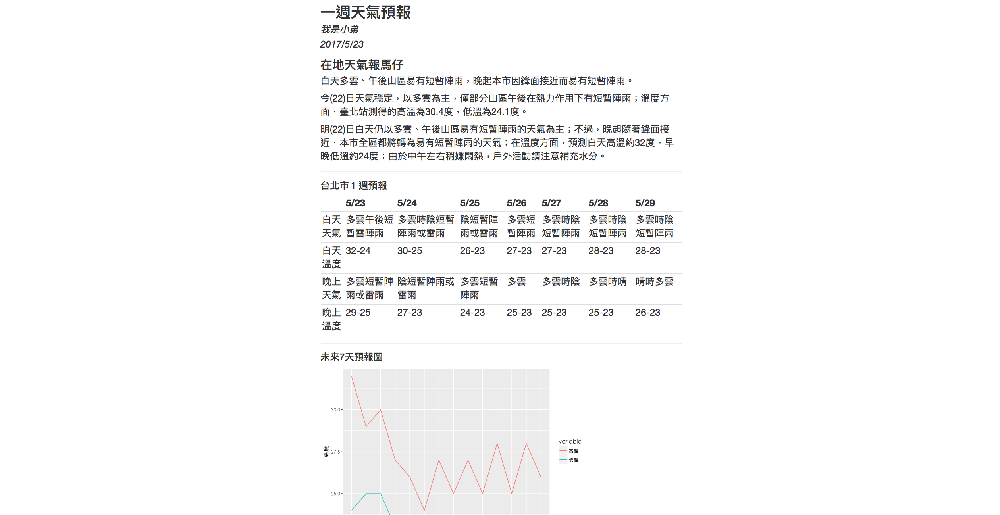</center>  

## Exercise - 3.1

利用R Markdown 製作《一周天氣預報》書面報告。

- 計算05/23日當日的最高溫與最低溫度

### **Hint：**
1. 下載weatherbig5.csv到自己的電腦上
2. 在R chunk中，利用read.csv()讀取檔案進行分析\
MAC : read.csv(,fileEncoding="big5")
3. 找出05/23當日最高溫 max()
4. 找出05/23當日最低溫 min()
5. use inline R chunk `r max()` 

## Answer - 3.1

利用R Markdown 製作《一周天氣預報》書面報告。

- 計算05/23日當日的最高溫與最低溫度

```{r include=FALSE}
# Hint for Linu& Mac：
dat <- read.csv("data/weatherbig5.csv", fileEncoding="big5") 
max(dat[1:2, 4:5])
min(dat[1:2, 4:5])
# 預測高溫約`r max(dat[1:2,4:5])`度，低溫約`r min(dat[1:2,4:5])`度
```

```{r eval=FALSE}
# Hint for Windows：
dat <- read.csv("data/weatherbig5.csv") 
max(dat[1:2, 4:5])
min(dat[1:2, 4:5])
# 預測高溫約`r max(dat[1:2,4:5])`度，低溫約`r min(dat[1:2,4:5])`度
```

## 呈現表格 in Rmarkdown - 1

- Print data directly:  

```{r}
print(head(women))
```

# Table in Rmarkdown

## 呈現表格 in Rmarkdown - 1

- 不用手動 key in 表格
- 在 Chunk 後面的參數多加上`results='asis'` 
- 在 Chunk 裡面打上`knitr::kable`，呈現表格在output上 
  
  <pre class="markdown"><code>&#96;&#96;&#96;{r, results='asis'}
  knitr::kable(women)
  &#96;&#96;&#96;
  </code></pre>
<center>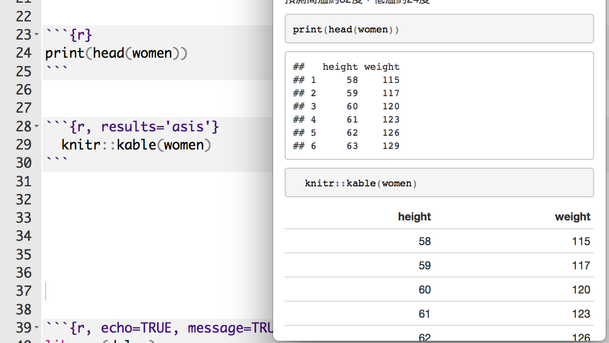</center>  


## 呈現表格 in Rmarkdown - 1

```{r results='asis', echo=FALSE}
knitr::kable(head(women))
```


## 呈現表格 in Rmarkdown - 2

- **DT 套件**
- 未安裝者記得先安裝 `install.packages("DT")`
- 使用前記得 `library(DT)`
- 易於呈現、美化表格
- [DT使用手冊](https://rstudio.github.io/DT/)

ex:
<pre class="markdown"><code>
&#96;&#96;&#96;{r}
datatable(head(iris))
&#96;&#96;&#96;
</code></pre>

## 呈現表格 in Rmarkdown - 2

- 調整表格呈現的列數
- 使用 `options = list(pageLength = 數字)` 參數調整

```{r, eval=FALSE}
# 呈現三列
datatable(iris, options = list(pageLength = 3))
# 呈現五列
datatable(cars, options = list(pageLength = 5)) 
```

## 呈現表格 in Rmarkdown - 2

- 可以利用 html 語法修改字體
- 標記特殊欄或列
- 調整欄

```{r, eval=FALSE}
datatable(iris) %>%
  formatStyle('Sepal.Length',  color = 'red', backgroundColor = 'orange', fontWeight = 'bold')
```

```{r, echo=FALSE, message=FALSE, warning=FALSE}
datatable(iris, options = list(pageLength = 3)) %>%
  formatStyle('Sepal.Length',  color = 'red', backgroundColor = 'orange', fontWeight = 'bold')
```

## 呈現表格 in Rmarkdown - 2

- 調整列

```{r, eval=FALSE}
datatable(cars) %>% formatStyle( 'dist' ,
  target = 'row',
  backgroundColor = styleEqual(c(10), c('pink'))
)
```

```{r, echo=FALSE, message=FALSE, warning=FALSE}
# 列
datatable(cars, options = list(pageLength = 5)) %>% formatStyle( 'dist' ,
  target = 'row',
  backgroundColor = styleEqual(c(10), c('pink'))
)
```


## Exercise - 3.2

利用R Markdown 製作《一周天氣預報》書面報告。
- 製作未來七天天氣預報表

### Hint：
- 你可能需要dplyr套件
- 可以先用filter把白天、晚上分開處理
- 利用 paste(低溫,高溫,sep="-") 來製作溫度區間, i.e. 16-17
- 利用colnames, rownames來對整理好的資料表的行與列命名


## Answer - 3.2

利用R Markdown 製作《一周天氣預報》書面報告。

- 製作未來七天天氣預報表

```{r}
day1 <- filter(dat, 早晚=="白天")
day2 <- mutate(day1, 溫度=paste(高溫,低溫,sep="-"))
day3 <- select(day2, 天氣, 溫度)

night1 <- filter(dat, 早晚=="晚上")
night2 <- mutate(night1, 溫度=paste(高溫,低溫,sep="-"))
night3 <- select(night2, 天氣, 溫度)

out <- data.frame(t(bind_cols(day3, night3)))
colnames(out) <- day1$日期
rownames(out) <- c("白天天氣","白天溫度","晚上天氣","晚上溫度")
```


## Answer 3.2

利用R Markdown 製作《一周天氣預報》書面報告。

- 製作未來七天天氣預報表

```{r}
knitr::kable(out)
```

## ...
|         |05/23      |05/24      |05/25      |05/26      |05/27    |05/28 |05/29 |
|:--------|:----------|:----------|:----------|:----------|:--------|:-----|:-----|
|白天天氣 |陰短暫雨   |多雲短暫雨 |多雲短暫雨 |陰短暫雨   |多雲時陰 |多雲  |多雲  |
|白天溫度 |32-24      |30-25      |26-23      |27-23      |27-23    |28-23 |28-23 |
|晚上天氣 |多雲短暫雨 |多雲短暫雨 |陰短暫雨   |多雲短暫雨 |多雲     |多雲  |多雲  |
|晚上溫度 |28-23      |27-23      |24-23      |25-23      |25-23    |25-23 |26-23 |


## Exercise - 3.3

利用R Markdown 製作《一周天氣預報》書面報告。

- 製作未來七天天氣預報圖

### Hint：
- 你可能需要`ggplot2`套件
- Mac顯示中文需設置字型: par(family='STHeiti')

## Answer 3.3

利用R Markdown 製作《一周天氣預報》書面報告。

- 製作未來七天天氣預報圖

```{r eval=FALSE}
library(ggplot2)
library(tidyr)
dat1 <- mutate(weather, 時間=paste(日期,早晚,sep="\n"))
dat2 <- select(dat1, 時間, 高溫, 低溫)
dat3 <- gather(dat2,variable,value,2:3)

ggplot(dat3, aes(x=時間, y=value, group=variable, colour=variable)) + 
  geom_line() + 
  labs(x="時間", y="溫度") +
  theme_gray(base_family="STHeiti") # 顯示中文字 Mac user only
```

## Answer 3.3

### 利用R Markdown 製作《一周天氣預報》書面報告。

- 以上參考解答code的產出參考報告
- [參考示範連結](https://pongponglin.github.io/2017NCCU_R/RMDsample.html#1)

# Table of Contents

##  目錄
- Rmarkdown 有提供目錄的功能
- 文件長時方便尋找
<center>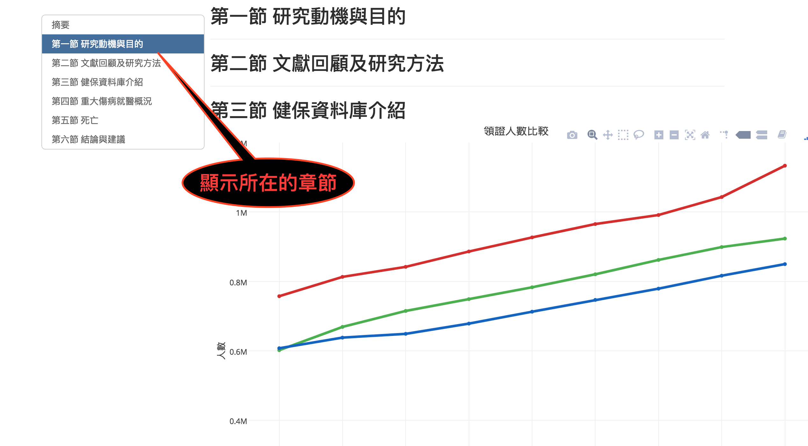</center>  

##  新增目錄

- 將以下複製貼上到Rmarkdown的開頭
- `theme: united` 表示目錄的主題選擇為 `united`，可以變動

```
---
title: "你Rmarkdown的名稱"
author: "名字"
date: "2017/5/20"
output:
  html_document:
    theme: united
    toc : true
    toc_float: true
---
```

##  新增目錄

- 目錄的長寬可以變動：透過`fig_width`以及`fig_height: 7.5`參數調整
- `toc_depth`表示顯示到多大的標題
    - ex: `toc_depth: 4` 會顯示有少於或等於四個井字號 `####` 的標題
    
```
---
title: "你Rmarkdown的名稱"
author: "名字"
date: "2017/5/20"
output:
  html_document:
    theme: united
    fig_width: 10
    fig_height: 7.5
    toc : true
    toc_depth: 4
    toc_float: true
---
```

##  Rmarkdown 內建主題選擇

- 可以透過點選的方式選則整個 RMD 的主題
- 改變項目包含目錄、顏色、字體
- 設定小圖示 -> `Output Options`...

<center>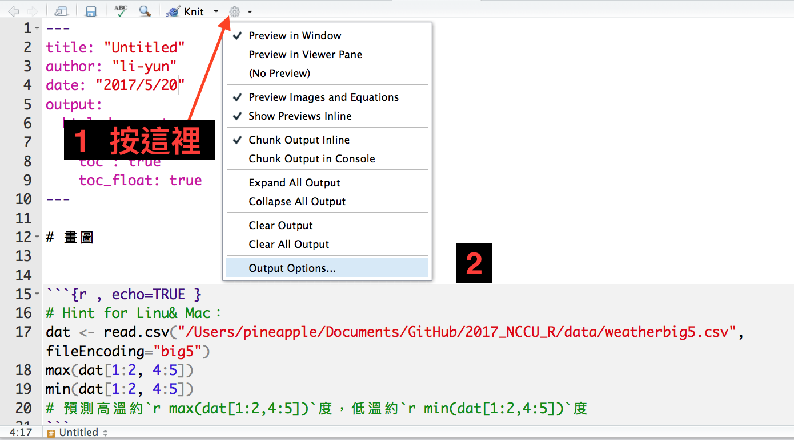</center>  

# 除了輸出 HTML

## Persentation - 1
- Rmarkdown 除了可以輸出 HTML 文件外，可以生成投影片

<center></center>  

## Persentation - 2
- `##` 代表一張投影片
- `#` 主題黑幕
- 要注意因為每張投影片長度限制，所以須控制內容

## Flexdashboard - 1

- 安裝套件 `install.packages("flexdashboard")`
- 使用前 `library(flexdashboard)`
- [flexdashboard 使用手冊](http://rmarkdown.rstudio.com/flexdashboard/)

<center>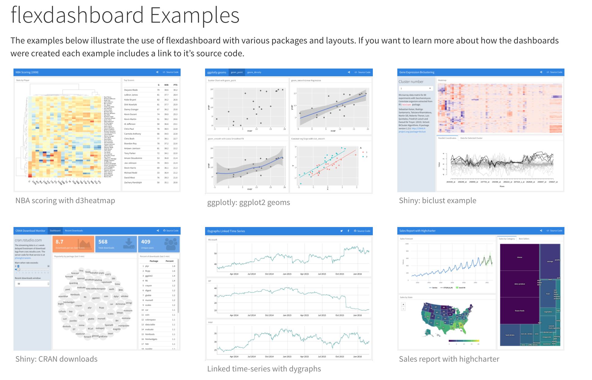</center>  

## Flexdashboard - 2

<center>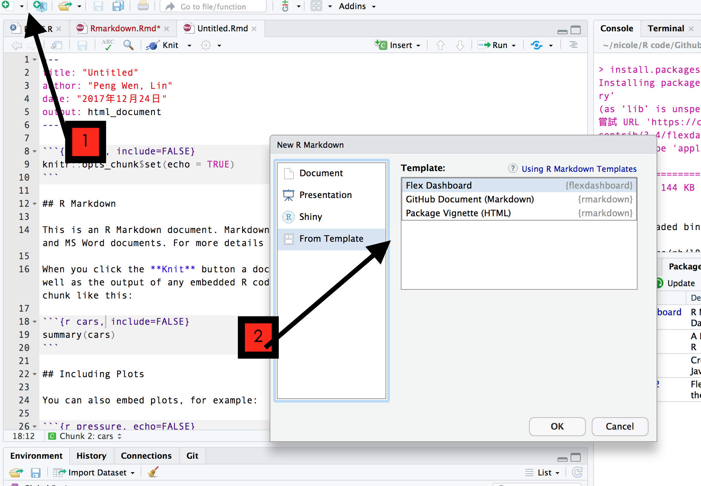</center>  

## 參考作品
- [實價登錄資料](https://lucy0222.github.io/2017_NCCU_R/%E5%AF%A6%E5%83%B9%E7%99%BB%E9%8C%84%E8%B3%87%E6%96%99.html) Li-yun 周立筠
- [互動式地圖教學](https://pongponglin.github.io/Playground/%E4%BA%92%E5%8B%95%E5%BC%8F%E5%9C%B0%E5%9C%96%E6%95%99%E5%AD%B8leaflet_plotly.html) Peng-Wen, Lin 林芃彣
- [2017 Asia Open Data Hackthon Dashboard](https://pongponglin.github.io/2017Taiwan-power-data/%E8%B7%A8%E5%9C%8B%E9%BB%91%E5%AE%A2%E6%9D%BE.html) (Flexdashboard) Life is struggle.
- [2017 TPC Hackthon](https://patrick501004123854.shinyapps.io/final/) (Shiny dashboard) Life is struggle.

### Shiny
- [Shiny Tutorial](https://shiny.rstudio.com/tutorial/)

# Appendiex

## About Document Content

You can add R Markdown and HTML in the YAML content.
<pre class="prettyprint lang-yaml"><code>
---
title: "Introduction to R Markdown"
author: "Lin"
date: "2016-06-30"
output: html_document
---
</code></pre>

## YAML metadata
<center>
`r fig("Cover.png", 80)`   
Cover by Wush
</center>

## Generate Markdown and HTML

<pre class="prettyprint lang-r"><code>&#96;&#96;&#96;{r results='asis', echo=FALSE}
library(whisker)
temp = '&#60span class="{{color}}{{number}}"&#62{{color}}{{number}}&#60/span&#62'
numbers = c("", "2", "3")
colors = c("red", "blue", "green", "yellow", "gray")
for (color in colors){
    cat("- ")
    for (number in numbers){
        out = whisker.render(temp)
        cat(out)
    }
    cat("\n")
}
&#96;&#96;&#96;</code></pre>

## Interactive Documents

It’s possible to embed a Shiny application within a document.

- 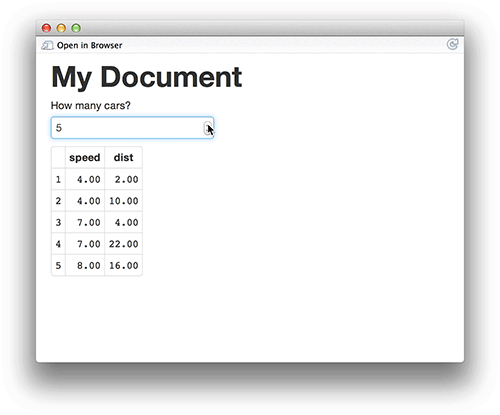 

</div>

## Publish to the web

Using R packages::slidify to publish your slides to the web
```
library(slidify)
publish_github("repo", username="user_name")
publish_rpubs("title","file_name.html")
publish_dropbox(dir_name)
publish_gist("title",file="file_name.html",publish=TRUE)
```

## Publish to the web: Github

1. sign up or login in Github.com at browser
2. find button: New repository to add new one.
3. select a name for repository, then created.
4. the link of your new repository would be like:  
    [https://github.com/"your_name"/"repo_name".git](https://github.com/your_name/repo_name.git)
5. find Settings in your profile at top-right corner
6. select SSH Keys and add SSH Key
7. upload your SSH key which created by your own PC/notebook.
8. at RStudio, using Rcommand:  
    slidify::publish_github("repo_name", username="your_name")
9. your new page will be ready in 5~10 min and link:  
    [https://"your_name".github.io/"repo_name"/index.html](https://your_name.github.io/repo_name/index.html)  

## Source
- [An Introduction to R Markdown*](http://mansunkuo.github.io/rmd_tutorial/) by Mansun Kuo @ [DSC2014](http://taiwanrusergroup.github.io/DSC2014Tutorial/)
- [R Markdown Cheat Sheet](http://shiny.rstudio.com/articles/rm-cheatsheet.html)
- [R Markdown](http://rmarkdown.rstudio.com/)
- [knitr](http://yihui.name/knitr/)
- [RStudio Documentation](https://support.rstudio.com/hc/en-us/categories/200035113-Documentation)
- [Reproducible Research](https://www.coursera.org/course/repdata)
- [Shiny Articles](http://shiny.rstudio.com/articles/)
- [Publish to Github Pages/Dropbox/Rpubs](http://slidify.org/publish.html)

## Wush 教學影片

[Slidify簡介](https://www.youtube.com/watch?v=P97udK2ktuY) by Wush Wu  
https://www.youtube.com/watch?v=P97udK2ktuY  

[20121203 MLDM Monday:markdown + knitr (Hangout 轉播)](https://www.youtube.com/watch?v=OHKZLeKlUsM) by Wush Wu  
https://www.youtube.com/watch?v=OHKZLeKlUsM


## 繼續學習之路
- 了解自己的需求，詢問關鍵字與函數
- [Taiwan R User Group](http://www.meetup.com/Taiwan-R)，mailing list: Taiwan-useR-Group-list@meetup.com
- [ptt R_Language版](https://www.ptt.cc/bbs/R_Language/index.html)
- [R軟體使用者論壇](https://groups.google.com/forum/#!forum/taiwanruser)
- [StackOverflow](http://stackoverflow.com/) 
- 歡迎來信  nicole19940331@gmail.com 與我們一起交流！

# Thank You!
